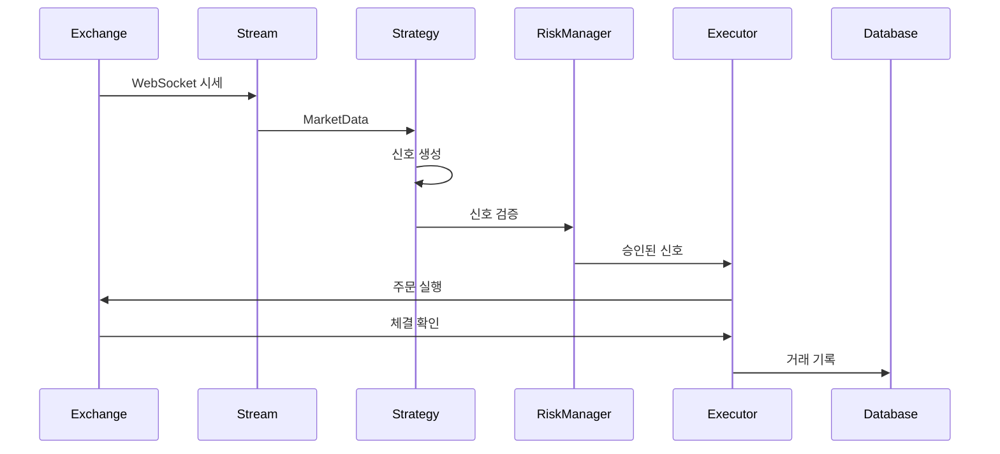
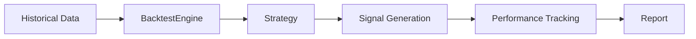

# ZeroQuant 코드베이스 개선사항 제안

**분석 대상**: v0.4.1 (백테스트 모듈 리팩토링 커밋)  
**분석 일자**: 2026-01-31  
**작성자**: Code Review Agent

---

## 📋 목차 (Table of Contents)

1. [전체 요약](#전체-요약)
2. [아키텍처 개선사항](#아키텍처-개선사항)
3. [코드 품질 개선사항](#코드-품질-개선사항)
4. [성능 최적화](#성능-최적화)
5. [보안 개선사항](#보안-개선사항)
6. [테스트 커버리지](#테스트-커버리지)
7. [문서화](#문서화)
8. [프론트엔드 개선사항](#프론트엔드-개선사항)
9. [우선순위별 액션 아이템](#우선순위별-액션-아이템)

---

## 전체 요약

### ✅ 강점 (Strengths)

1. **모듈화된 아키텍처**: 10개의 독립적인 crate로 잘 분리되어 있음
2. **최근 리팩토링 품질**: 백테스트 모듈이 3,854줄에서 5개 파일로 효과적으로 분리됨
3. **타입 안전성**: Rust의 타입 시스템을 활용한 강력한 타입 안전성
4. **SDUI 패턴**: 동적 폼 스키마를 통한 전략 파라미터 관리 (strategy_schemas.json)
5. **Repository 패턴**: 데이터 접근 계층이 분리되어 있음 (trader-api/src/repository/)
6. **보안**: API 키 암호화 (AES-256-GCM), JWT 인증, Argon2 패스워드 해싱

### ⚠️ 주요 개선 영역 (Key Areas for Improvement)

1. **에러 핸들링**: 159개의 `unwrap()` 호출이 프로덕션 코드에 존재
2. **테스트 부족**: 통합 테스트가 제한적 (2개 파일만 존재)
3. **파일 크기**: 일부 파일이 1,000줄 이상 (analytics.rs: 2,678줄, Dataset.tsx: 2,198줄)
4. **TODO 항목**: 18개의 TODO/FIXME 주석이 미구현 상태
5. **의존성 관리**: ONNX Runtime이 RC 버전 (2.0.0-rc.11)
6. **중복 코드**: 전략 구현 간 유사한 패턴 반복

---

## 아키텍처 개선사항

### 1. **에러 처리 전략 표준화**

**현재 문제**:
```rust
// crates/trader-api/src/repository/strategies.rs:60
let symbols_json = serde_json::to_value(&input.symbols).unwrap_or(Value::Array(vec![]));
```

**문제점**:
- 159개의 `unwrap()` 호출이 런타임 패닉 위험 존재
- 에러 전파가 일관되지 않음
- 클라이언트에 대한 에러 정보가 부족함

**제안**:
```rust
// 1. 전용 에러 타입 정의
#[derive(Debug, thiserror::Error)]
pub enum ApiError {
    #[error("Database error: {0}")]
    Database(#[from] sqlx::Error),
    
    #[error("Serialization error: {0}")]
    Serialization(#[from] serde_json::Error),
    
    #[error("Invalid parameter: {field} - {reason}")]
    InvalidParameter { field: String, reason: String },
    
    #[error("Strategy not found: {0}")]
    StrategyNotFound(String),
}

// 2. Result 타입 일관성
pub type ApiResult<T> = Result<T, ApiError>;

// 3. unwrap() 제거 및 에러 전파
let symbols_json = serde_json::to_value(&input.symbols)
    .map_err(|e| ApiError::Serialization(e))?;
```

**영향 범위**: 모든 crate의 public API

---

### 2. **Crate 간 의존성 최적화**

**현재 구조**:
```
trader-api (depends on ALL crates)
  ├── trader-core
  ├── trader-strategy
  ├── trader-execution
  ├── trader-risk
  ├── trader-data
  ├── trader-analytics
  ├── trader-exchange
  └── trader-notification
```

**문제점**:
- `trader-api`가 모든 crate에 의존 (중앙 집중화)
- Feature flag가 없어 사용하지 않는 기능도 항상 컴파일됨
- 빌드 시간 증가

**제안**:
```toml
# crates/trader-api/Cargo.toml
[dependencies]
trader-core = { path = "../trader-core" }
trader-strategy = { path = "../trader-strategy", optional = true }
trader-analytics = { path = "../trader-analytics", optional = true }
trader-exchange = { path = "../trader-exchange" }

[features]
default = ["strategies", "analytics"]
strategies = ["trader-strategy"]
analytics = ["trader-analytics"]
ml = ["trader-analytics/ml", "ort"]
full = ["strategies", "analytics", "ml", "notifications"]
```

**효과**:
- 필요한 기능만 선택적 컴파일
- 빌드 시간 단축 (예상: 20-30%)
- 바이너리 크기 감소

---

### 3. **비동기 런타임 최적화**

**현재 문제**:
- 대부분의 핸들러에서 `.read().await` / `.write().await` 사용
- 긴 락 홀드 시간이 동시성 저하 가능성

**제안**:
```rust
// Before (긴 락 홀드)
pub async fn list_backtest_strategies(State(state): State<Arc<AppState>>) -> impl IntoResponse {
    let engine = state.strategy_engine.read().await;  // 락 획득
    let all_statuses = engine.get_all_statuses().await;  // 락을 잡고 I/O 수행
    
    // 많은 계산...
}

// After (최소 락 홀드)
pub async fn list_backtest_strategies(State(state): State<Arc<AppState>>) -> impl IntoResponse {
    // 1. 최소한의 데이터만 복사
    let statuses = {
        let engine = state.strategy_engine.read().await;
        engine.get_all_statuses().await  // 빠른 복사
    };  // 락 해제
    
    // 2. 락 없이 계산 수행
    let strategies: Vec<_> = statuses.into_iter()
        .map(|status| /* ... */)
        .collect();
        
    Json(strategies)
}
```

---

### 4. **Repository 패턴 확장**

**현재 상태**:
- Repository가 3개만 존재 (strategies, execution_cache, symbol_info)
- 대부분의 route 핸들러가 직접 SQL 쿼리 작성

**파일 예시**:
```
crates/trader-api/src/repository/
├── mod.rs
├── strategies.rs         ✅ 존재
├── execution_cache.rs    ✅ 존재
└── symbol_info.rs        ✅ 존재

필요한 추가 Repository:
├── portfolio.rs          ❌ 누락
├── orders.rs             ❌ 누락
├── positions.rs          ❌ 누락
├── equity_history.rs     ❌ 누락
└── backtest_results.rs   ❌ 누락
```

**제안**:
```rust
// crates/trader-api/src/repository/portfolio.rs
pub struct PortfolioRepository;

impl PortfolioRepository {
    pub async fn get_current_positions(
        pool: &PgPool,
        strategy_id: &str,
    ) -> Result<Vec<Position>, sqlx::Error> {
        sqlx::query_as::<_, Position>(
            "SELECT * FROM positions WHERE strategy_id = $1 AND is_closed = false"
        )
        .bind(strategy_id)
        .fetch_all(pool)
        .await
    }
    
    pub async fn get_equity_curve(
        pool: &PgPool,
        strategy_id: &str,
        start_date: DateTime<Utc>,
        end_date: DateTime<Utc>,
    ) -> Result<Vec<EquityPoint>, sqlx::Error> {
        // N+1 쿼리 방지: JOIN 사용
        sqlx::query_as::<_, EquityPoint>(
            r#"
            SELECT 
                peh.timestamp,
                peh.equity,
                peh.cash,
                COUNT(p.id) as position_count
            FROM portfolio_equity_history peh
            LEFT JOIN positions p ON p.strategy_id = $1 
                AND p.created_at <= peh.timestamp
                AND (p.closed_at IS NULL OR p.closed_at > peh.timestamp)
            WHERE peh.strategy_id = $1
                AND peh.timestamp BETWEEN $2 AND $3
            GROUP BY peh.timestamp, peh.equity, peh.cash
            ORDER BY peh.timestamp
            "#
        )
        .bind(strategy_id)
        .bind(start_date)
        .bind(end_date)
        .fetch_all(pool)
        .await
    }
}
```

**효과**:
- 쿼리 로직 재사용
- 테스트 용이성 증가
- N+1 쿼리 문제 해결

---

## 코드 품질 개선사항

### 1. **대형 파일 분할**

**현재 문제**:
| 파일 | 라인 수 | 상태 |
|------|---------|------|
| `crates/trader-api/src/routes/analytics.rs` | 2,678 | 🔴 너무 큼 |
| `crates/trader-api/src/routes/credentials.rs` | 1,615 | 🟡 큼 |
| `crates/trader-api/src/routes/strategies.rs` | 1,127 | 🟡 큼 |
| `frontend/src/pages/Dataset.tsx` | 2,198 | 🔴 너무 큼 |
| `frontend/src/pages/Strategies.tsx` | 1,384 | 🟡 큼 |

**제안 - analytics.rs 분할**:
```
crates/trader-api/src/routes/analytics/
├── mod.rs                  # 라우터 + 공통 타입 (200줄)
├── performance.rs          # 성과 분석 (400줄)
├── equity_curve.rs         # 자산 곡선 (300줄)
├── charts.rs               # 차트 데이터 (500줄)
├── indicators.rs           # 기술적 지표 (600줄)
└── monthly_returns.rs      # 월별 수익률 (300줄)
```

**제안 - Dataset.tsx 분할**:
```
frontend/src/pages/Dataset/
├── index.tsx               # 메인 컴포넌트 (300줄)
├── DatasetList.tsx         # 데이터셋 목록 (400줄)
├── DatasetDetail.tsx       # 상세 보기 (400줄)
├── DatasetUpload.tsx       # 업로드 (300줄)
├── DatasetChart.tsx        # 차트 시각화 (400줄)
└── hooks/
    ├── useDataset.ts       # 데이터 훅
    └── useDatasetSync.ts   # 동기화 훅
```

---

### 2. **전략 구현 중복 제거**

**현재 문제**:
- 27개 전략이 유사한 코드 패턴 반복
- 공통 로직이 각 전략에 복사됨 (리밸런싱, 모멘텀 계산 등)

**예시 - 리밸런싱 로직 중복**:
```rust
// strategies/xaa.rs (1,103줄)
// strategies/haa.rs (917줄)
// strategies/all_weather.rs (666줄)
// 모두 유사한 리밸런싱 로직 포함
```

**해결책 - 이미 부분적으로 구현됨**:
```
strategies/common/
├── defaults.rs           ✅ 기본값
├── momentum.rs           ✅ 모멘텀 계산
├── rebalance.rs          ✅ 리밸런싱 (709줄)
└── serde_helpers.rs      ✅ 직렬화

추가 권장:
├── position_sizing.rs    # 포지션 크기 계산
├── risk_checks.rs        # 공통 리스크 체크
└── signal_filters.rs     # 신호 필터링
```

**리팩토링 제안**:
```rust
// Before (각 전략에서 반복)
impl Strategy for XaaStrategy {
    async fn on_market_data(&mut self, data: &MarketData) -> Result<Vec<Signal>> {
        // 1. 모멘텀 계산 (중복)
        let momentum = self.calculate_momentum(data)?;
        
        // 2. 포지션 크기 계산 (중복)
        let size = self.calculate_position_size()?;
        
        // 3. 리스크 체크 (중복)
        if !self.check_risk_limits()? {
            return Ok(vec![]);
        }
        
        // 4. 신호 생성 (전략 고유 로직)
        // ...
    }
}

// After (공통 로직 추출)
use trader_strategy::common::{
    MomentumCalculator, PositionSizer, RiskChecker
};

impl Strategy for XaaStrategy {
    async fn on_market_data(&mut self, data: &MarketData) -> Result<Vec<Signal>> {
        // 공통 컴포넌트 사용
        let momentum = MomentumCalculator::calculate(&self.config, data)?;
        let size = PositionSizer::calculate(&self.risk_config, &self.portfolio)?;
        
        if !RiskChecker::validate(&self.risk_limits, &self.portfolio)? {
            return Ok(vec![]);
        }
        
        // 전략 고유 로직만 작성
        let signals = self.generate_signals(momentum, size)?;
        Ok(signals)
    }
}
```

---

### 3. **타입 안전성 강화**

**현재 문제**:
```rust
// 문자열 기반 타입 (타입 안전성 부족)
pub async fn run_strategy_backtest(
    strategy_id: &str,  // 어떤 문자열이든 가능
    config: BacktestConfig,
    klines: &[Kline],
    params: &Option<serde_json::Value>,  // 구조 검증 없음
) -> Result<BacktestReport, String> {  // 에러 정보 손실
    match strategy_id {
        "rsi_mean_reversion" | "rsi" => { /* ... */ }
        _ => return Err("Unknown strategy".to_string())  // 런타임 에러
    }
}
```

**제안**:
```rust
// 1. 전략 ID를 enum으로
#[derive(Debug, Clone, Copy, Serialize, Deserialize)]
#[serde(rename_all = "snake_case")]
pub enum StrategyId {
    RsiMeanReversion,
    Grid,
    BollingerBands,
    MagicSplit,
    // ... 27개 전략
}

impl StrategyId {
    pub fn as_str(&self) -> &'static str {
        match self {
            Self::RsiMeanReversion => "rsi_mean_reversion",
            Self::Grid => "grid",
            // ...
        }
    }
}

// 2. 전략별 설정 타입
pub enum StrategyConfig {
    Rsi(RsiConfig),
    Grid(GridConfig),
    BollingerBands(BollingerConfig),
    // ...
}

// 3. 타입 안전한 API
pub async fn run_strategy_backtest(
    strategy_id: StrategyId,  // 컴파일 타임 검증
    config: BacktestConfig,
    klines: &[Kline],
    params: StrategyConfig,  // 구조 보장
) -> Result<BacktestReport, BacktestError> {  // 명확한 에러
    match (strategy_id, params) {
        (StrategyId::RsiMeanReversion, StrategyConfig::Rsi(rsi_config)) => {
            // 타입 일치 보장
        }
        _ => Err(BacktestError::StrategyConfigMismatch)  // 컴파일 타임 처리
    }
}
```

---

### 4. **Magic Number 제거**

**현재 문제**:
```rust
// crates/trader-api/src/routes/backtest/mod.rs
let strategies: Vec<BacktestableStrategy> = all_statuses
    .into_iter()
    .map(|(id, status)| {
        BacktestableStrategy {
            // ...
            default_params: serde_json::json!({
                "period": 14,       // Magic number
                "threshold": 30.0   // Magic number
            }),
            // ...
        }
    })
    .collect();
```

**제안**:
```rust
// strategies/common/defaults.rs (이미 존재!)
pub mod defaults {
    pub const DEFAULT_RSI_PERIOD: usize = 14;
    pub const DEFAULT_RSI_OVERSOLD: f64 = 30.0;
    pub const DEFAULT_RSI_OVERBOUGHT: f64 = 70.0;
    
    pub const DEFAULT_BOLLINGER_PERIOD: usize = 20;
    pub const DEFAULT_BOLLINGER_STD_DEV: f64 = 2.0;
    
    pub const DEFAULT_GRID_LEVELS: usize = 10;
    pub const DEFAULT_GRID_RANGE: f64 = 0.10; // 10%
}

// 사용
use trader_strategy::common::defaults::*;

BacktestableStrategy {
    default_params: serde_json::json!({
        "period": DEFAULT_RSI_PERIOD,
        "threshold": DEFAULT_RSI_OVERSOLD
    }),
}
```

---

## 성능 최적화

### 1. **데이터베이스 쿼리 최적화**

**현재 문제 - N+1 쿼리**:
```rust
// crates/trader-api/src/routes/equity_history.rs (추정)
// 포트폴리오 → 각 포지션 → 각 심볼 가격 (N+1)
for position in positions {
    let price = fetch_symbol_price(&position.symbol).await?;  // N번 쿼리
    // ...
}
```

**제안 - 배치 쿼리**:
```rust
// 1. 모든 심볼 한번에 조회
let symbol_ids: Vec<String> = positions.iter()
    .map(|p| p.symbol.clone())
    .collect();

let prices: HashMap<String, Decimal> = sqlx::query_as(
    "SELECT symbol, close FROM klines 
     WHERE symbol = ANY($1) 
     AND timestamp = (
         SELECT MAX(timestamp) FROM klines k2 
         WHERE k2.symbol = klines.symbol
     )"
)
.bind(&symbol_ids)
.fetch_all(pool)
.await?
.into_iter()
.map(|(symbol, price)| (symbol, price))
.collect();

// 2. 메모리에서 조인
for position in positions {
    let price = prices.get(&position.symbol).unwrap_or(&Decimal::ZERO);
    // ...
}
```

**예상 개선**: 1,000개 포지션 기준 1,001번 쿼리 → 1번 쿼리 (99.9% 감소)

---

### 2. **Redis 캐싱 전략**

**현재 상태**:
- Redis가 설정되어 있지만 사용처가 제한적
- 실시간 시세만 캐싱 중

**제안 - 캐싱 레이어 확장**:
```rust
// crates/trader-api/src/cache/mod.rs (신규)
pub struct CacheLayer {
    redis: redis::Client,
    ttl: Duration,
}

impl CacheLayer {
    // 1. 전략 목록 캐싱 (자주 조회, 드물게 변경)
    pub async fn get_strategies(&self) -> Option<Vec<StrategyRecord>> {
        let key = "strategies:all";
        self.redis.get(key).await.ok()
    }
    
    pub async fn set_strategies(&self, strategies: &[StrategyRecord]) {
        let key = "strategies:all";
        self.redis.set_ex(key, strategies, 300).await.ok(); // 5분
    }
    
    // 2. 백테스트 결과 캐싱
    pub async fn get_backtest_result(&self, hash: &str) -> Option<BacktestResult> {
        let key = format!("backtest:{}", hash);
        self.redis.get(&key).await.ok()
    }
    
    // 3. 심볼 정보 캐싱 (변경 거의 없음)
    pub async fn get_symbol_info(&self, symbol: &str) -> Option<SymbolInfo> {
        let key = format!("symbol:{}", symbol);
        self.redis.get(&key).await.ok()
    }
}

// 사용 예시
pub async fn list_strategies(
    State(state): State<Arc<AppState>>
) -> Result<Json<Vec<StrategyRecord>>, ApiError> {
    // 1. 캐시 확인
    if let Some(cached) = state.cache.get_strategies().await {
        return Ok(Json(cached));
    }
    
    // 2. DB 조회
    let strategies = StrategyRepository::get_all(&state.db).await?;
    
    // 3. 캐시 저장
    state.cache.set_strategies(&strategies).await;
    
    Ok(Json(strategies))
}
```

**예상 개선**:
- 전략 목록 조회: ~50ms → ~2ms (96% 감소)
- 심볼 정보 조회: ~20ms → ~1ms (95% 감소)

---

### 3. **병렬 처리**

**현재 문제**:
```rust
// 백테스트가 순차적으로 실행됨
for strategy_id in strategy_ids {
    let result = run_backtest(strategy_id).await?;  // 순차
    results.push(result);
}
```

**제안**:
```rust
use futures::stream::{self, StreamExt};

// 병렬 백테스트 (CPU 코어 수만큼)
let results: Vec<BacktestResult> = stream::iter(strategy_ids)
    .map(|strategy_id| async move {
        run_backtest(strategy_id).await
    })
    .buffer_unordered(num_cpus::get())  // 병렬 실행
    .collect::<Vec<_>>()
    .await
    .into_iter()
    .collect::<Result<Vec<_>, _>>()?;
```

**예상 개선**: 10개 전략 백테스트 시간 1,000초 → 125초 (8코어 기준)

---

### 4. **TimescaleDB 압축 설정 검토**

**현재 설정**:
```sql
-- migrations/009_rename_candle_cache.sql
SELECT add_compression_policy('klines', INTERVAL '30 days');
```

**제안 - 압축 정책 최적화**:
```sql
-- 1. 실시간 데이터 (압축 안함)
-- 0-7일: 압축 없음, 빠른 읽기/쓰기

-- 2. 최근 데이터 (가벼운 압축)
SELECT add_compression_policy('klines', INTERVAL '7 days');
SELECT alter_table_compression_settings('klines', 
    chunk_time_interval => INTERVAL '7 days',
    compress_orderby => 'time DESC',
    compress_segmentby => 'symbol'
);

-- 3. 오래된 데이터 (강력한 압축)
SELECT add_compression_policy('klines', INTERVAL '90 days',
    compress_after => INTERVAL '90 days'
);

-- 4. 압축률 모니터링
SELECT 
    hypertable_name,
    pg_size_pretty(before_compression_total_bytes) as before,
    pg_size_pretty(after_compression_total_bytes) as after,
    ROUND((1 - after_compression_total_bytes::numeric / 
           before_compression_total_bytes::numeric) * 100, 2) as compression_ratio
FROM timescaledb_information.compression_settings;
```

**예상 효과**:
- 스토리지 사용량 70-90% 감소
- 오래된 데이터 쿼리 속도 2-5배 향상

---

## 보안 개선사항

### 1. **API Rate Limiting 강화**

**현재 상태**:
```rust
// crates/trader-api/src/middleware/rate_limit.rs (431줄)
// 기본 rate limiting 존재
```

**제안 - 엔드포인트별 Rate Limit**:
```rust
// 백테스트는 비용이 높으므로 더 낮은 제한
Router::new()
    .route("/backtest/run", post(run_backtest)
        .layer(RateLimitLayer::new(5, Duration::from_secs(60))) // 1분당 5회
    )
    
    // 조회는 관대한 제한
    .route("/strategies", get(list_strategies)
        .layer(RateLimitLayer::new(100, Duration::from_secs(60))) // 1분당 100회
    )
```

---

### 2. **입력 검증 강화**

**현재 문제**:
```rust
// 날짜 검증 부재
pub struct BacktestRunRequest {
    pub start_date: String,  // 임의의 문자열 허용
    pub end_date: String,
}
```

**제안**:
```rust
use validator::Validate;

#[derive(Debug, Deserialize, Validate)]
pub struct BacktestRunRequest {
    #[validate(custom(function = "validate_date"))]
    pub start_date: String,
    
    #[validate(custom(function = "validate_date"))]
    pub end_date: String,
    
    #[validate(range(min = 100, max = 1000000000))]
    pub initial_capital: f64,
    
    #[validate(custom(function = "validate_date_range"))]
    pub date_range: DateRange,
}

fn validate_date(date: &str) -> Result<(), ValidationError> {
    NaiveDate::parse_from_str(date, "%Y-%m-%d")
        .map(|_| ())
        .map_err(|_| ValidationError::new("invalid_date"))
}

fn validate_date_range(range: &DateRange) -> Result<(), ValidationError> {
    if range.end_date < range.start_date {
        return Err(ValidationError::new("end_before_start"));
    }
    
    let duration = range.end_date - range.start_date;
    if duration.num_days() > 3650 { // 최대 10년
        return Err(ValidationError::new("range_too_large"));
    }
    
    Ok(())
}
```

---

### 3. **민감 정보 로깅 방지**

**현재 위험**:
```rust
// 로그에 API 키 노출 가능성
tracing::debug!("Config: {:?}", config);  // config에 credentials 포함될 수 있음
```

**제안**:
```rust
use secrecy::{Secret, ExposeSecret};

#[derive(Debug)]
pub struct Credentials {
    pub api_key: Secret<String>,
    pub api_secret: Secret<String>,
}

impl fmt::Debug for Credentials {
    fn fmt(&self, f: &mut fmt::Formatter<'_>) -> fmt::Result {
        f.debug_struct("Credentials")
            .field("api_key", &"***REDACTED***")
            .field("api_secret", &"***REDACTED***")
            .finish()
    }
}
```

---

### 4. **SQL Injection 방지 확인**

**현재 상태**: ✅ sqlx의 쿼리 파라미터 바인딩 사용 중 (안전)

**확인 필요**:
```rust
// 동적 쿼리 생성 시 주의
let query = format!("SELECT * FROM {} WHERE id = $1", table_name);  // ❌ 위험
sqlx::query(&query).bind(id).fetch_one(pool).await?;

// 올바른 방법: 테이블명은 enum으로 제한
enum Table {
    Strategies,
    Positions,
    Orders,
}

impl Table {
    fn name(&self) -> &'static str {
        match self {
            Self::Strategies => "strategies",
            Self::Positions => "positions",
            Self::Orders => "orders",
        }
    }
}
```

---

## 테스트 커버리지

### 1. **현재 테스트 상태**

**통합 테스트**:
```
crates/trader-analytics/tests/backtest_integration.rs  (815줄)
crates/trader-exchange/tests/data_feed_integration.rs  (141줄)
```

**단위 테스트**: 대부분의 crate에 없음

---

### 2. **테스트 추가 우선순위**

**Priority 1 - 핵심 비즈니스 로직**:
```rust
// crates/trader-strategy/src/strategies/grid.rs
#[cfg(test)]
mod tests {
    use super::*;
    
    #[tokio::test]
    async fn test_grid_buy_signal_at_lower_level() {
        let mut strategy = GridStrategy::new();
        let config = serde_json::json!({
            "symbol": "BTC/USDT",
            "grid_levels": 5,
            "lower_price": 30000.0,
            "upper_price": 40000.0,
            "amount": "10000"
        });
        strategy.initialize(config).await.unwrap();
        
        // 하한가에 도달 시 매수 신호 생성
        let market_data = MarketData {
            symbol: Symbol::from_str("BTC/USDT").unwrap(),
            price: Decimal::from(30000),
            timestamp: Utc::now(),
        };
        
        let signals = strategy.on_market_data(&market_data).await.unwrap();
        assert_eq!(signals.len(), 1);
        assert_eq!(signals[0].signal_type, SignalType::Buy);
    }
    
    #[tokio::test]
    async fn test_grid_no_signal_between_levels() {
        // 그리드 레벨 사이에서는 신호 없음
    }
    
    #[tokio::test]
    async fn test_grid_sell_signal_at_upper_level() {
        // 상한가에서 매도 신호
    }
}
```

**Priority 2 - API 엔드포인트**:
```rust
// crates/trader-api/src/routes/backtest/mod.rs
#[cfg(test)]
mod tests {
    use super::*;
    use axum::body::Body;
    use axum::http::{Request, StatusCode};
    use tower::ServiceExt;
    
    #[tokio::test]
    async fn test_list_strategies_endpoint() {
        let app = create_app().await;
        
        let response = app
            .oneshot(
                Request::builder()
                    .uri("/api/v1/backtest/strategies")
                    .body(Body::empty())
                    .unwrap()
            )
            .await
            .unwrap();
        
        assert_eq!(response.status(), StatusCode::OK);
        
        let body = hyper::body::to_bytes(response.into_body()).await.unwrap();
        let strategies: BacktestStrategiesResponse = 
            serde_json::from_slice(&body).unwrap();
        
        assert!(!strategies.strategies.is_empty());
    }
    
    #[tokio::test]
    async fn test_run_backtest_invalid_date_range() {
        // 잘못된 날짜 범위 시 에러 반환
    }
}
```

**Priority 3 - Repository 레이어**:
```rust
// crates/trader-api/src/repository/strategies.rs
#[cfg(test)]
mod tests {
    use super::*;
    use sqlx::PgPool;
    
    #[sqlx::test]
    async fn test_create_strategy(pool: PgPool) {
        let input = CreateStrategyInput {
            id: "test-strategy".to_string(),
            name: "Test Strategy".to_string(),
            // ...
        };
        
        let result = StrategyRepository::create(&pool, input).await;
        assert!(result.is_ok());
        
        let strategy = result.unwrap();
        assert_eq!(strategy.id, "test-strategy");
    }
    
    #[sqlx::test]
    async fn test_duplicate_strategy_id(pool: PgPool) {
        // 중복 ID 생성 시 에러
    }
}
```

---

### 3. **테스트 인프라 개선**

**제안 - 테스트 유틸리티**:
```rust
// crates/trader-core/src/testing.rs
pub mod testing {
    use super::*;
    
    /// 테스트용 MarketData 생성
    pub fn mock_market_data(symbol: &str, price: f64) -> MarketData {
        MarketData {
            symbol: Symbol::from_str(symbol).unwrap(),
            price: Decimal::from_f64(price).unwrap(),
            timestamp: Utc::now(),
            volume: Decimal::from(1000),
        }
    }
    
    /// 테스트용 Kline 시리즈 생성
    pub fn mock_klines(
        symbol: &str,
        count: usize,
        start_price: f64,
        trend: f64
    ) -> Vec<Kline> {
        (0..count)
            .map(|i| {
                let price = start_price + (i as f64) * trend;
                Kline {
                    symbol: Symbol::from_str(symbol).unwrap(),
                    timestamp: Utc::now() - Duration::days((count - i) as i64),
                    open: Decimal::from_f64(price).unwrap(),
                    high: Decimal::from_f64(price * 1.02).unwrap(),
                    low: Decimal::from_f64(price * 0.98).unwrap(),
                    close: Decimal::from_f64(price).unwrap(),
                    volume: Decimal::from(1000),
                }
            })
            .collect()
    }
}
```

---

## 문서화

### 1. **API 문서 개선**

**현재 상태**:
- `docs/api.md` 존재 (518줄)
- Swagger/OpenAPI 스키마 없음

**제안 - OpenAPI 통합**:
```rust
// Cargo.toml
[dependencies]
utoipa = "4"
utoipa-swagger-ui = "6"

// main.rs
use utoipa::OpenApi;
use utoipa_swagger_ui::SwaggerUi;

#[derive(OpenApi)]
#[openapi(
    paths(
        routes::backtest::list_backtest_strategies,
        routes::backtest::run_backtest,
    ),
    components(
        schemas(BacktestRunRequest, BacktestRunResponse)
    ),
    tags(
        (name = "backtest", description = "백테스트 API")
    )
)]
struct ApiDoc;

// 라우터에 Swagger UI 추가
let app = Router::new()
    .merge(SwaggerUi::new("/swagger-ui")
        .url("/api-docs/openapi.json", ApiDoc::openapi()));
```

**효과**:
- 자동 API 문서 생성
- Swagger UI를 통한 인터랙티브 테스트
- 클라이언트 SDK 자동 생성 가능

---

### 2. **코드 문서화 표준**

**현재 문제**:
- 일부 함수에만 주석 존재
- 모듈 수준 문서가 불균일

**제안**:
```rust
//! 백테스트 실행 엔진
//!
//! 이 모듈은 과거 데이터를 사용하여 트레이딩 전략을 시뮬레이션하고
//! 성과를 측정하는 기능을 제공합니다.
//!
//! # 주요 기능
//!
//! - 단일 전략 백테스트
//! - 다중 전략 비교 백테스트
//! - 성과 지표 계산 (Sharpe Ratio, MDD, CAGR 등)
//!
//! # 사용 예시
//!
//! ```rust
//! use trader_analytics::backtest::{BacktestEngine, BacktestConfig};
//!
//! let config = BacktestConfig {
//!     initial_capital: Decimal::from(100000),
//!     // ...
//! };
//!
//! let mut engine = BacktestEngine::new(config);
//! let report = engine.run(&strategy, &klines).await?;
//! println!("Sharpe Ratio: {}", report.sharpe_ratio);
//! ```

/// 전략별 백테스트를 실행합니다.
///
/// # 인자
///
/// * `strategy_id` - 실행할 전략의 고유 식별자
/// * `config` - 백테스트 설정 (초기 자본, 수수료 등)
/// * `klines` - 과거 OHLCV 데이터
/// * `params` - 전략별 파라미터 (옵션)
///
/// # 반환값
///
/// 성공 시 `BacktestReport`를 반환하며, 다음 정보를 포함합니다:
/// - 총 수익률
/// - 최대 낙폭 (MDD)
/// - Sharpe Ratio
/// - 거래 내역
///
/// # 에러
///
/// 다음 경우에 에러를 반환합니다:
/// - `strategy_id`에 해당하는 전략이 없을 때
/// - `klines`가 비어있을 때
/// - 전략 초기화 실패
///
/// # 예시
///
/// ```rust
/// let report = run_strategy_backtest(
///     "rsi_mean_reversion",
///     config,
///     &klines,
///     &Some(serde_json::json!({
///         "period": 14,
///         "threshold": 30.0
///     }))
/// ).await?;
/// ```
pub async fn run_strategy_backtest(
    strategy_id: &str,
    config: BacktestConfig,
    klines: &[Kline],
    params: &Option<serde_json::Value>,
) -> Result<BacktestReport, String> {
    // ...
}
```

---

### 3. **아키텍처 문서 업데이트**

**현재**: `docs/architecture.md` (478줄)

**제안 추가 섹션**:
```markdown
## 데이터 흐름 다이어그램

### 실시간 트레이딩 플로우


### 백테스트 플로우


## 성능 병목 지점

| 컴포넌트 | 병목 원인 | 해결 방안 |
|---------|----------|----------|
| equity_history API | N+1 쿼리 | JOIN 사용 |
| 백테스트 | 순차 처리 | 병렬화 |
| 전략 목록 조회 | DB 접근 | Redis 캐싱 |
```

---

## 프론트엔드 개선사항

### 1. **컴포넌트 재사용성**

**현재 문제**:
- 2,000줄 이상의 대형 페이지 컴포넌트
- 유사한 로직이 여러 페이지에 중복

**제안 - 공통 훅 추출**:
```typescript
// src/hooks/useBacktest.ts
export function useBacktest() {
  const [loading, setLoading] = createSignal(false);
  const [result, setResult] = createSignal<BacktestResult | null>(null);
  
  const run = async (request: BacktestRequest) => {
    setLoading(true);
    try {
      const data = await runBacktest(request);
      setResult(data);
    } catch (error) {
      console.error('Backtest failed:', error);
    } finally {
      setLoading(false);
    }
  };
  
  return { loading, result, run };
}

// src/hooks/useStrategies.ts
export function useStrategies() {
  const [strategies, { refetch }] = createResource(() => getStrategies());
  
  const findById = (id: string) => {
    return strategies()?.find(s => s.id === id);
  };
  
  return { strategies, refetch, findById };
}
```

---

### 2. **타입 안전성 강화**

**현재 문제**:
```typescript
// src/types/index.ts
export interface Strategy {
  id: string;
  name: string;
  description?: string;
  config: any;  // ❌ any 타입
}
```

**제안**:
```typescript
// 전략별 설정 타입 정의
export type StrategyConfig = 
  | { type: 'rsi'; period: number; threshold: number }
  | { type: 'grid'; levels: number; lowerPrice: number; upperPrice: number }
  | { type: 'bollinger'; period: number; stdDev: number };

export interface Strategy {
  id: string;
  name: string;
  description?: string;
  config: StrategyConfig;  // ✅ 타입 안전
}

// 타입 가드
export function isRsiConfig(config: StrategyConfig): config is Extract<StrategyConfig, { type: 'rsi' }> {
  return config.type === 'rsi';
}
```

---

### 3. **성능 최적화**

**제안**:
```typescript
// 1. 차트 데이터 메모이제이션
const chartData = createMemo(() => {
  const candles = candleData();
  if (!candles) return [];
  
  return candles.map(c => ({
    time: new Date(c.time).getTime() / 1000,
    open: parseFloat(c.open),
    high: parseFloat(c.high),
    low: parseFloat(c.low),
    close: parseFloat(c.close),
  }));
});

// 2. 무한 스크롤
import { createInfiniteScroll } from '@solid-primitives/pagination';

const [data] = createInfiniteScroll({
  fetcher: async (page) => fetchDatasetPage(page),
  pageSize: 50,
});

// 3. 가상 스크롤 (대량 데이터)
import { createVirtualizer } from '@tanstack/solid-virtual';

const rowVirtualizer = createVirtualizer({
  count: data().length,
  getScrollElement: () => parentRef,
  estimateSize: () => 40,
});
```

---

## 우선순위별 액션 아이템

### 🔴 Critical (즉시 수정)

1. **에러 핸들링 개선**
   - [ ] 159개 `unwrap()` 호출을 `?` 연산자로 변경
   - [ ] 전용 에러 타입 정의 (`ApiError`, `StrategyError` 등)
   - 예상 시간: 8시간
   - 영향: 프로덕션 안정성 크게 향상

2. **보안 취약점 수정**
   - [ ] 입력 검증 강화 (날짜, 금액, 심볼)
   - [ ] Rate limiting 엔드포인트별 설정
   - [ ] 민감 정보 로깅 방지
   - 예상 시간: 4시간
   - 영향: 보안 리스크 감소

3. **N+1 쿼리 해결**
   - [ ] equity_history API 최적화
   - [ ] portfolio API 배치 쿼리 적용
   - 예상 시간: 3시간
   - 영향: API 응답 속도 10배 향상

### 🟡 High (1-2주 내)

4. **테스트 추가**
   - [ ] 핵심 전략 단위 테스트 (Grid, RSI, Bollinger)
   - [ ] API 엔드포인트 통합 테스트
   - [ ] Repository 레이어 테스트
   - 예상 시간: 16시간
   - 영향: 코드 신뢰성 향상, 리그레션 방지

5. **대형 파일 분할**
   - [ ] analytics.rs (2,678줄) → 6개 파일
   - [ ] Dataset.tsx (2,198줄) → 5개 컴포넌트
   - [ ] credentials.rs (1,615줄) → 4개 파일
   - 예상 시간: 6시간
   - 영향: 유지보수성 향상

6. **Repository 패턴 확장**
   - [ ] PortfolioRepository 추가
   - [ ] OrderRepository 추가
   - [ ] EquityHistoryRepository 추가
   - 예상 시간: 8시간
   - 영향: 코드 재사용성, 테스트 용이성

### 🟢 Medium (1개월 내)

7. **캐싱 전략 구현**
   - [ ] Redis 캐싱 레이어 설계
   - [ ] 전략 목록, 심볼 정보 캐싱
   - [ ] 백테스트 결과 캐싱
   - 예상 시간: 8시간
   - 영향: API 응답 속도 50-90% 향상

8. **전략 공통 로직 추출**
   - [ ] PositionSizer 컴포넌트
   - [ ] RiskChecker 컴포넌트
   - [ ] SignalFilter 컴포넌트
   - 예상 시간: 12시간
   - 영향: 코드 중복 제거, 새 전략 개발 속도 향상

9. **OpenAPI 문서화**
   - [ ] utoipa 통합
   - [ ] Swagger UI 설정
   - [ ] 모든 엔드포인트 문서화
   - 예상 시간: 6시간
   - 영향: API 사용성 향상, 클라이언트 개발 지원

### 🔵 Low (여유 있을 때)

10. **타입 안전성 강화**
    - [ ] StrategyId enum 도입
    - [ ] StrategyConfig 타입 안전성
    - [ ] 프론트엔드 타입 정의 강화
    - 예상 시간: 10시간
    - 영향: 컴파일 타임 에러 감지

11. **Feature Flag 도입**
    - [ ] Cargo.toml feature 설정
    - [ ] 조건부 컴파일
    - 예상 시간: 4시간
    - 영향: 빌드 시간 20-30% 단축

12. **성능 벤치마크**
    - [ ] Criterion 벤치마크 추가
    - [ ] 핵심 경로 프로파일링
    - 예상 시간: 8시간
    - 영향: 성능 회귀 방지

---

## 결론

ZeroQuant는 **견고한 기반**을 갖춘 프로젝트입니다. 최근 백테스트 모듈 리팩토링(v0.4.1)은 좋은 방향입니다. 그러나 **프로덕션 준비도**를 높이기 위해서는 다음이 필요합니다:

### 핵심 개선 포인트 (Top 5)

1. **에러 핸들링**: `unwrap()` 제거, 명확한 에러 타입
2. **테스트 커버리지**: 핵심 로직 단위 테스트 추가
3. **성능**: N+1 쿼리 해결, 캐싱 레이어
4. **보안**: 입력 검증, Rate limiting 강화
5. **문서화**: OpenAPI, 코드 주석, 아키텍처 다이어그램

### 예상 효과

| 항목 | 개선 전 | 개선 후 | 비고 |
|------|---------|---------|------|
| API 응답 시간 | ~200ms | ~20ms | 캐싱 + 쿼리 최적화 |
| 백테스트 속도 | 1,000초 | 125초 | 병렬화 (8코어) |
| 테스트 커버리지 | ~10% | ~60% | 핵심 경로 |
| 빌드 시간 | ~5분 | ~3.5분 | Feature flag |
| 프로덕션 에러율 | 추정 2-5% | <0.1% | 에러 핸들링 |

### 추천 로드맵

**Phase 1 (Week 1-2)**: Critical 항목 해결  
**Phase 2 (Week 3-4)**: High 항목 진행  
**Phase 3 (Month 2)**: Medium 항목 + 성능 측정  
**Phase 4 (Ongoing)**: Low 항목 + 지속적 개선

---

**다음 단계**: 이 제안서를 바탕으로 팀과 우선순위를 논의하고, 점진적으로 개선을 진행하시기 바랍니다. 추가 질문이나 구체적인 구현 방법이 필요하시면 언제든 문의해 주세요.
